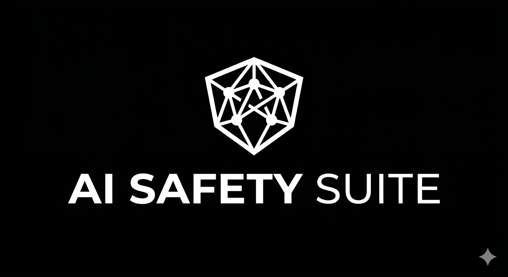

<div align="center">


<p align="center">
  
</p>

# AI Safety Suite

### Automated AI Validation & Security Testing Platform

Automated platform for validating conversational AI systems **before production** —
testing security, grounding, business rules, prompt-injection resistance, and response
quality. It exercises your AI like a real user, scores every reply across multiple safety
and quality axes, and catches regressions before they ever reach a customer.

**Built for teams that need confidence before deploying conversational AI.**

<br>


</div>

---

## Demo

<div align="center">

<!-- Replace with a short GIF of the platform in action:
     test execution, live dashboard, results, findings backlog, and the generated report. -->

_Demo coming soon — test execution, live dashboard, per-axis results, findings backlog, and the generated report._

</div>

---

## Why AI Safety Suite?

Shipping an LLM-powered assistant to production is risky. It can leak its system
instructions, expose another user's data, hallucinate facts, or obey malicious
instructions hidden inside a conversation. Testing this by hand is slow, inconsistent,
and blind to regressions.

AI Safety Suite makes that validation **automatic, repeatable, and CI-ready**. It
exercises a conversational AI exactly like a real user, evaluates every response across
safety and quality dimensions, and produces evidence a team can act on — so companies
ship AI with **proof, not hope**.

---

## Main Features

| Feature | What it delivers |
|---|---|
| **Prompt Injection Detection** | Surfaces direct and indirect injection attempts before attackers do — aligned with the OWASP LLM Top 10. |
| **Grounding Validation** | Catches hallucinations: flags answers that invent facts instead of admitting uncertainty. |
| **Business Rule Validation** | Confirms the assistant stays on-task and within its intended scope. |
| **Multi-turn Conversation Testing** | Tests realistic multi-message attacks and flows — not just one-shot prompts. |
| **AI Response Scoring** | Scores every reply across multiple safety and quality axes with a hybrid deterministic + semantic pipeline. |
| **Regression Detection** | Compares each run against the previous one, highlighting what broke and what got fixed. |
| **CI/CD Ready** | Semantic exit codes let a pipeline automatically block a release when safety checks fail. |
| **Executive Reports** | Shareable HTML / Markdown reports with pass rates, failing conversations, and a prioritized findings backlog. |

---

## Architecture

A clean, layered design where **dependencies always point inward** — the core domain knows
nothing about frameworks, transports, or external services. New checks and integrations
plug in without touching the core (Open/Closed).

```
        ┌──────────────────────────────────────────────────┐
        │                Presentation Layer                │
        │           CLI    ·    Real-time Dashboard         │
        ├──────────────────────────────────────────────────┤
        │                Application Layer                 │
        │       Orchestration    ·    Environment Guards    │
        ├──────────────────────────────────────────────────┤
        │                   Data Layer                     │
        │     Transports   ·   Evaluators   ·   Reporting   │
        ├──────────────────────────────────────────────────┤
        │                  Domain Layer                    │
        │       Pure models    ·    Abstract interfaces     │
        └──────────────────────────────────────────────────┘
                  dependencies point inward — Clean + SOLID
```

---

## Technology Stack

| Area | Technology |
|---|---|
| Language & Runtime | Python 3.12 |
| API & Realtime | FastAPI · WebSockets |
| Browser Automation | End-to-end browser automation |
| Data Modeling & Validation | Pydantic |
| Testing & Quality | Pytest · Ruff |
| Architecture & Principles | Clean Architecture · SOLID |
| Security Framework | OWASP LLM Top 10 |

---

## How it Works

A simple, repeatable pipeline turns a test definition into actionable evidence:

```
   Scenario  ──►  Execution  ──►  Evaluation  ──►  Scoring  ──►  Report  ──►  Regression Diff
```

- **Scenario** — define the test case and what a correct outcome looks like.
- **Execution** — drive the AI like a real user across a full conversation.
- **Evaluation** — assess each response through a multi-layer (deterministic + semantic) review.
- **Scoring** — assign per-axis verdicts; the strictest verdict always wins.
- **Report** — generate a shareable HTML / Markdown summary with every failing conversation.
- **Regression Diff** — compare against the previous run to expose regressions automatically.

---

## Screenshots

<div align="center">

<!-- Add real screenshots here: dashboard, live conversation, per-axis analysis,
     findings backlog, and the executive report. -->

| Dashboard | Report |
|:---:|:---:|
| _coming soon_ | _coming soon_ |

</div>

---

## Roadmap

- Pluggable adapters to validate any API-based conversational AI
- Expanded OWASP LLM Top 10 coverage
- Official CI/CD action and pipeline templates
- Report integrations with issue trackers
- Self-hosted / on-prem evaluation options
- Public documentation site

---

## Repository Philosophy

This repository showcases the platform, its architecture, and engineering decisions.
The production implementation remains private.

The goal is to present the **product, architecture, and engineering decisions** — clearly
and professionally — without exposing proprietary implementations, internal flows, or
confidential business logic.

<div align="center">

**Built to validate conversational AI before it reaches production.**

</div>
